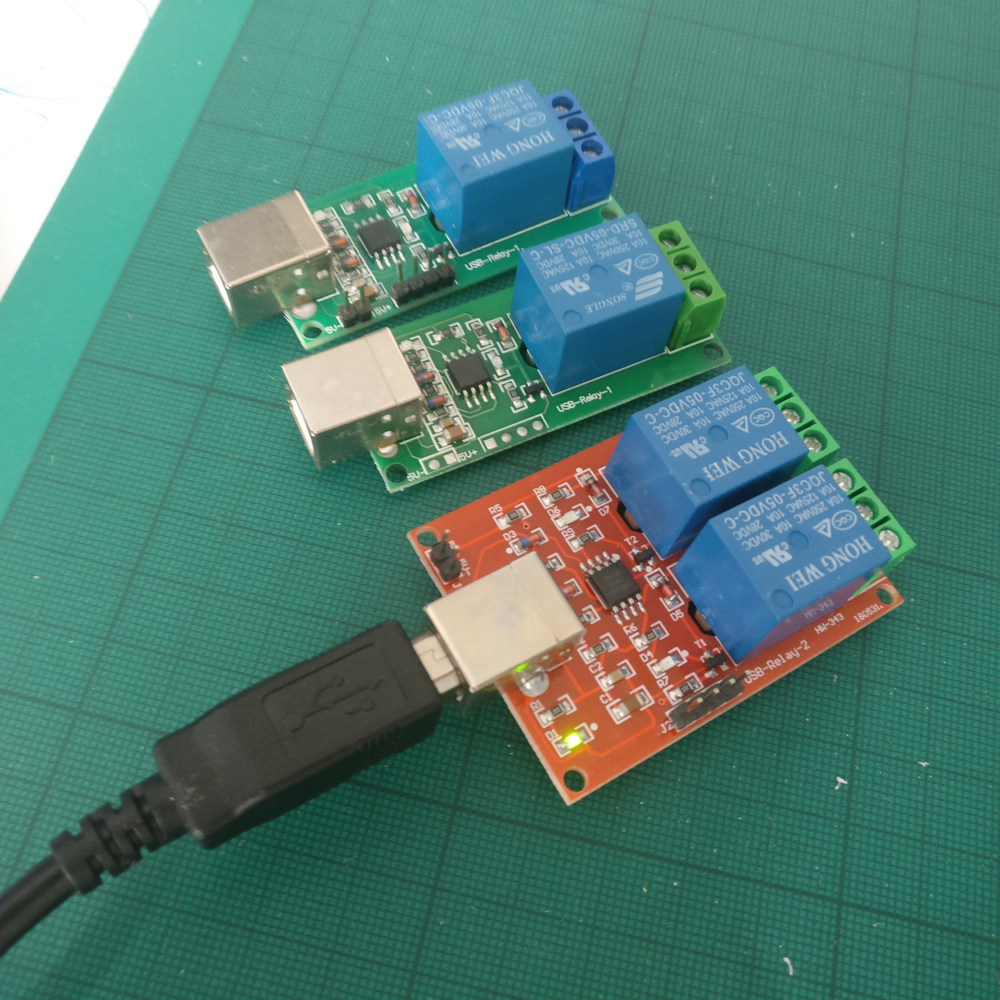

## Node Red - USB HID Relay Nodes


Allows control of cheap hid relays in node red. HID relays do not show up as COM port devices. Instead they are HID devices, and have an internal serial number which can be used to differenciate them. These devices are far suppior to their Virtual COM port counterparts.

Models supported:
* HW-348
* HW-343
* HW-341
* Models with USB-Relay-1, USB-Relay-2 or USB-Relay-4 printed on the PCB



### Installation

#### Dependancy
For linux you will need to make sure you install the libudev-dev package. For debian and raspbian this should be done with the following:
```sudo apt-get install libudev-dev librtlsdr-dev libusb-1.0-0-dev libpthread-stubs0-dev```

In node red, via libraries search for USB-HID-relay. Select and hit install. If this fails, please report to issue's on the projects GitHub page.

### Usage

* Plug in your usb relay
* Add a output->"usb relay" node to you node-red project.
* Double click the node, and select the relay from the drop down list*. 
* Send a message to the node, with either msg.payload equal to ```true``` to turn on, and ```false``` to turn off.

**note devices with more than one relay have multiple entries in the drop down* 


